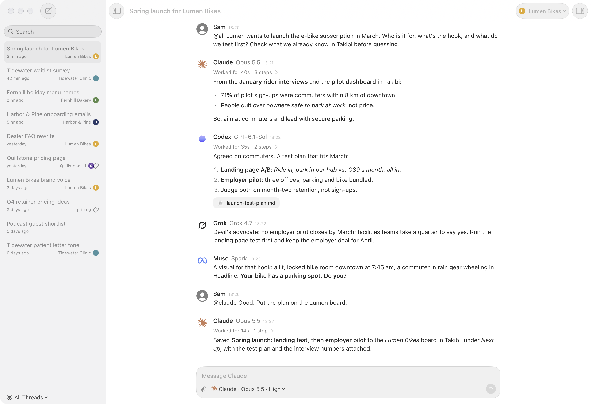
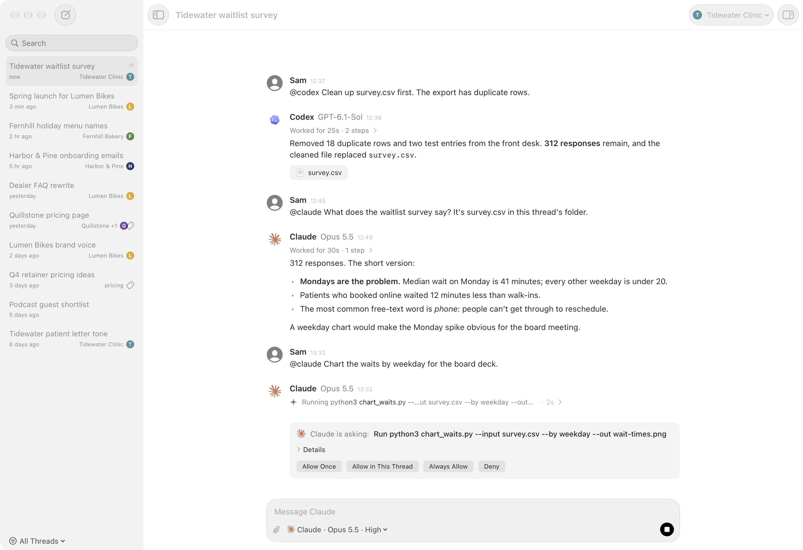
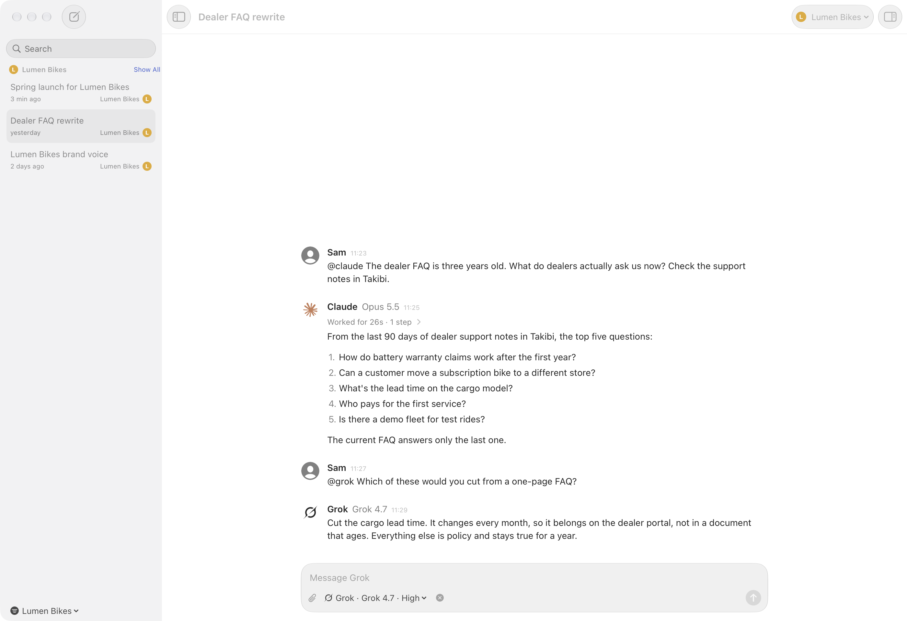
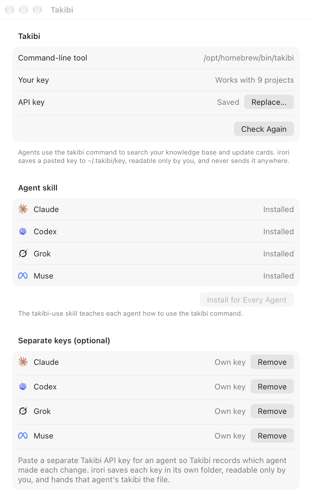
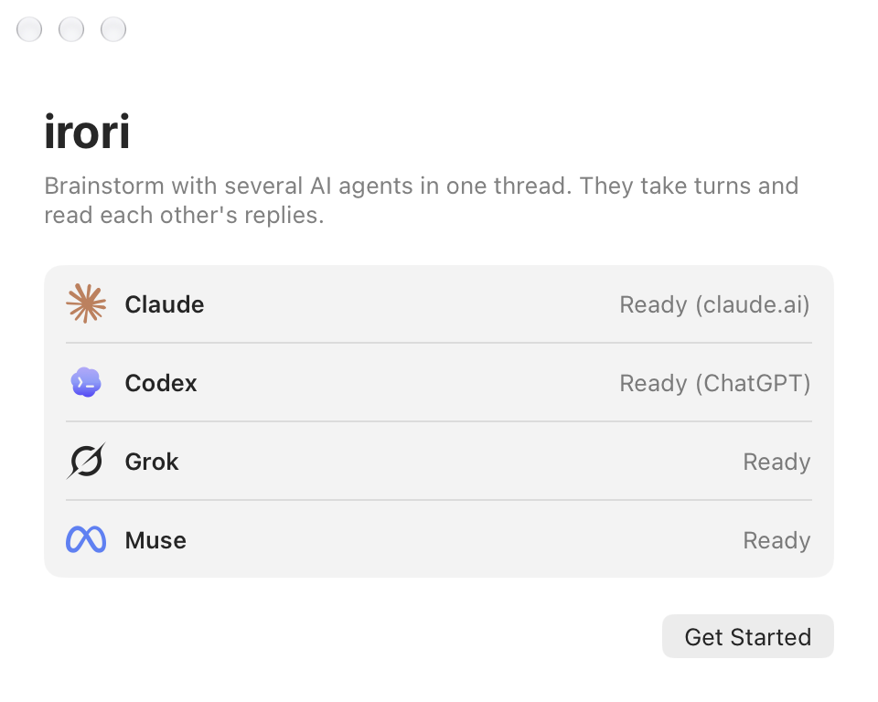

<div align="center">


# irori

**Brainstorm with Claude Code, Codex, Grok, and Muse in one thread, on your Mac.**

囲炉裏 · *ih-ROH-ree* · a sunken hearth people gather around to talk

[](#requirements)
[](https://www.swift.org)
[](LICENSE)
[](https://github.com/tofuchick3n/irori/releases/latest)
[](https://github.com/tofuchick3n/irori/actions/workflows/ci.yml)

<a href="https://github.com/tofuchick3n/irori/releases/latest"></a>

<br><br>

<picture>
  <source media="(prefers-color-scheme: dark)" srcset="docs/screenshots/roundtable-dark.png">
  
</picture>

</div>

irori is a native macOS app for brainstorming with several AI agents around one hearth. Claude Code, Codex, Grok, and Muse take turns in a shared conversation, each reading what the others said. It is an independent side project that works with [Takibi Base](https://takibibase.com), the shared knowledge base for AI agents: agents can work with your Takibi documents and task board through the `takibi` command. You don't need Takibi to use it.

## Why

One model gives you one point of view. Asking four of them means four tabs, four copies of the context, and you pasting answers between them. irori puts them in one thread instead: ask once, let them build on or argue with each other, and keep the whole conversation in one place.

irori is a thin, local shell. It starts each agent's own command-line tool, shows the conversation, and keeps your threads on your Mac. It has no server, no account, and no telemetry.

## Features

- **Roundtable threads.** Mention `@claude`, `@codex`, `@grok`, or `@muse` to choose who answers, or `@all` for everyone in turn. Agents see each other's replies.
- **Your models and effort.** Pick each agent's model and reasoning effort, discovered from its own CLI. Every reply shows the model that wrote it.
- **Live progress.** See when an agent is thinking or running a command, and stop a reply at any time (⌘.).
- **Know when it's done.** Start a long `@all` turn and switch away: a notification and a dock badge tell you when the agents have finished, and the sidebar marks threads you haven't read.
- **Voice input.** Click the mic or press ⇧⌘D and talk; words appear as you speak. Speech is transcribed on your Mac by the small Whistle model and never leaves it.
- **Find anything.** Search every thread from the sidebar, or find text in the open thread with ⌘F.
- **Redo a turn.** Copy a reply as text or Markdown, retry the last reply, or take back your last message to edit it.
- **Easy start.** A welcome window shows which agents are installed and signed in, empty threads offer example prompts, and a turn that fails because an agent isn't installed or signed in says how to fix it. Help → How Roundtables Work explains the rest.
- **Client tags.** Tag threads by client or topic, with logos, and filter the sidebar. Agents are told the thread's tags as its topic, so in a thread tagged `lumen-bikes` they start from Lumen Bikes material when they look things up, and a tag named like a Takibi project tells them which project to search.
- **Takibi built in, thinly.** Install the `takibi-use` skill for every agent, give each agent its own API key so Takibi records who changed what, and ask an agent to save a reply to a card.
- **Plain safety settings.** Each thread gets its own folder, where agents keep what they make. One switch decides whether they may write files at all, and anything beyond reading and read-only commands asks you first (details [below](#how-agents-are-kept-in-bounds)).

## Screenshots

<table>
  <tr>
    <td width="50%"><br><sub>Approvals happen in the thread.</sub></td>
    <td width="50%"><br><sub>Tag threads by client and filter the sidebar.</sub></td>
  </tr>
  <tr>
    <td width="50%"><br><sub>Connect <a href="https://takibibase.com">Takibi Base</a> once for every agent.</sub></td>
    <td width="50%"><br><sub>The welcome window checks your agents.</sub></td>
  </tr>
</table>

## Requirements

- macOS 26 or later on Apple silicon
- At least one of these, installed and signed in:
  - [Claude Code](https://claude.com/claude-code) (`claude`)
  - [Codex CLI](https://github.com/openai/codex) (`codex`)
  - Grok CLI (`grok`)
  - Muse CLI (`muse`)
- Optional: the `takibi` CLI and a [Takibi Base API key](https://takibibase.com/docs/access)

irori never signs in to anything itself. Each CLI keeps its own login; Settings → Agents shows whether each one is signed in and opens its login command in Terminal if not.

## Install

Download the latest disk image from [Releases](https://github.com/tofuchick3n/irori/releases/latest), open it, and drag irori to Applications. irori updates itself through Sparkle.

Or [build it yourself](#build-from-source).

### Upgrading from an earlier version

The first launch moves your threads, tags, keys, and settings over from the app's earlier names.

## Use with Takibi Base

[Takibi Base](https://takibibase.com) is a shared knowledge base and task board for AI agents and teams: you add your documents, choose what each agent may read, and agents get exact passages back with citations. In irori, that means every agent at the table can look things up in the same sources and pick up or update the same tasks.

1. Install the `takibi` CLI. [Connect an agent](https://takibibase.com/docs/agents) in the Takibi docs walks through it.
2. Open Settings → Takibi and paste your API key ([how keys and access work](https://takibibase.com/docs/access)). The app saves it to `~/.takibi/key`, readable only by you.
3. Click **Install for Every Agent** so each agent learns the `takibi` command.
4. Optional: paste a separate key for each agent so Takibi's history shows which agent made each change.

Then ask in a thread, for example "@all check Takibi for what we decided about onboarding, then propose next steps", or have an agent turn a reply into a card on the [task board](https://takibibase.com/docs/tasks). New to Takibi? [Start here](https://takibibase.com).

## How agents are kept in bounds

| Agent | With file writes on | With file writes off |
|---|---|---|
| Claude | Edits files in the thread's folder without asking; runs read-only commands and the shell commands you allow (default: `takibi`) without asking | Asks before each edit |
| Codex | Its sandbox allows writes to the thread's folder and network access | Read-only sandbox, no network |
| Grok | Its sandbox allows writes to the thread's folder | Read-only sandbox |
| Muse | Writes to the thread's folder | No writes and no shell (so no `takibi`) |

Claude isn't sandboxed: the thread folder is its working directory, and anything it does beyond that goes through these approvals. Reads never ask, including read-only commands such as `ls`, `cat`, and `git status`. Web search and web fetch are allowed in every thread until you remove them in Settings → Permissions. When Claude or Codex wants to do anything else (run a command, use a tool), it asks in the thread with **Allow Once**, **Allow in This Thread**, **Always Allow**, **Allow Everything in This Thread**, or **Deny**. **Allow Everything in This Thread** lets every later request through for every agent in that thread, and the thread shows a shield in the sidebar. Always-allowed tools and commands are listed in Settings → Permissions. **Reset Permissions for This Thread** in the sidebar menu clears that choice and the thread's other permissions. Grok and Muse still run inside their sandboxes without asking. Stop denies anything still waiting.

## Build from source

You need macOS 26 on Apple silicon and Xcode 26 (Swift 6.2 or later).

```sh
scripts/fetch-whistle   # once: the speech engine and model, into .build/whistle
swift build --disable-sandbox
swift test --disable-sandbox
scripts/make-app        # build/irori.app, ad-hoc signed: open it from there
```

With a Developer ID certificate in your keychain, `scripts/install-app` signs and installs to /Applications, and `scripts/make-dmg` builds a signed disk image and Sparkle feed (see [docs/RELEASING.md](docs/RELEASING.md)).

Some tests talk to real tools and are off by default:

```sh
DESK_LIVE=1 swift test --disable-sandbox --filter Live          # the four agent CLIs
DESK_LIVE=1 swift test --disable-sandbox --filter Whistle       # the speech model on speech from `say`
DESK_WINDOW_TESTS=1 swift test --disable-sandbox --filter SidebarControl
DESK_SNAPSHOT_DIR=out DESK_SNAPSHOT_THREADS=threads swift test --disable-sandbox --filter Snapshot
```

The SwiftPM target is still called `Desk`; only the product is named irori.

## FAQ

**Does irori send my conversations anywhere?**
Not to us. There is no irori server, account, or telemetry. Each message goes only to the agent CLIs you use, under their own logins and terms, and threads are stored on your Mac. Voice input is transcribed on device. irori itself only checks this repository's releases for updates (Sparkle). The agent CLIs make their own requests; if the `takibi` CLI is installed, irori runs it to list your Takibi projects; and previewing an HTML file from a thread loads whatever that file links to.

**Do I need Takibi Base?**
No. irori works with just the agent CLIs. [Takibi Base](https://takibibase.com) adds a shared knowledge base and task board that every agent in the thread can use.

**Why do agents run one at a time?**
So each one can read what the others said before it answers. That is the point of a roundtable.

**Can I add another agent?**
Not from the app. Fork it: agents are listed in `Sources/Desk/AgentID.swift`, and each has its own command and runner files next to it (for example `GrokCommand.swift` and `GrokAgentRunner.swift`).

## Contributing

irori is not maintained as a community project, and pull requests are closed automatically without review. That's not a judgment on your change: the app is small and opinionated, and the best way to change it is to make it yours. It's GPL-3.0 licensed, so [fork it](https://github.com/tofuchick3n/irori/fork) and go; your fork stays open source under the same license. [CONTRIBUTING.md](CONTRIBUTING.md) explains how to rebrand a fork.

Issues are turned off too: irori is a free side project with no support, and if something breaks, your fork is the place to fix it. Security problems are the exception; see [SECURITY.md](SECURITY.md).

## Credits

Agent logos come from [lobe-icons](https://github.com/lobehub/lobe-icons) (MIT). Claude, Codex, Grok, and Muse are trademarks of their owners; the app uses their marks only to show which agent is speaking.

Updates use [Sparkle](https://sparkle-project.org).

Voice input uses [Whistle](https://huggingface.co/Cactus-Compute/whistle) on the [Needle](https://huggingface.co/Cactus-Compute/needle3) engine by Cactus Compute (Apache 2.0). The engine is a prebuilt library; `scripts/fetch-whistle` downloads it and the model at pinned revisions and checks their checksums.

The app icon is drawn by `scripts/make-icon.swift`. Full license texts are in [THIRD_PARTY_NOTICES.md](THIRD_PARTY_NOTICES.md).

irori is an independent side project by [tofuchick3n](https://github.com/tofuchick3n) that works with [Takibi Base](https://takibibase.com).

## License

Copyright © 2026 Deian Isac. irori is free software under the GNU General Public License v3.0; see [LICENSE](LICENSE). You can use, change, and share it, including selling copies, as long as you pass on the source under the same license.

The name "irori" and the app icon are not covered by the license. A fork needs its own name and icon.
